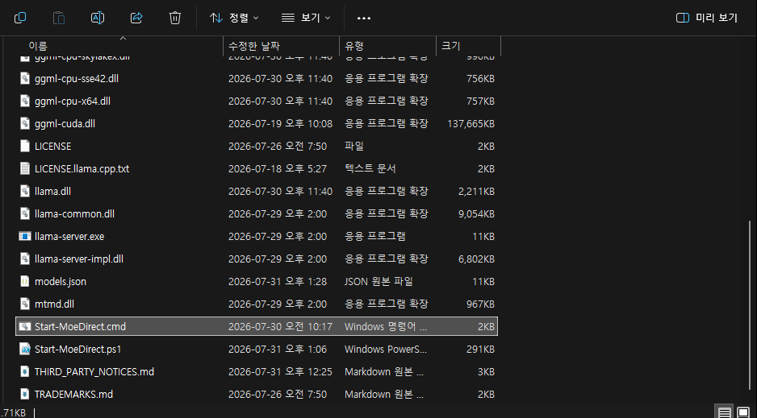
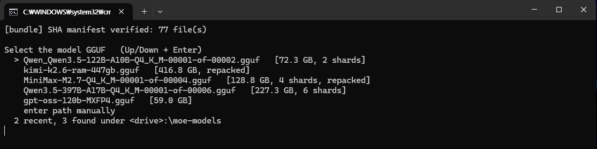
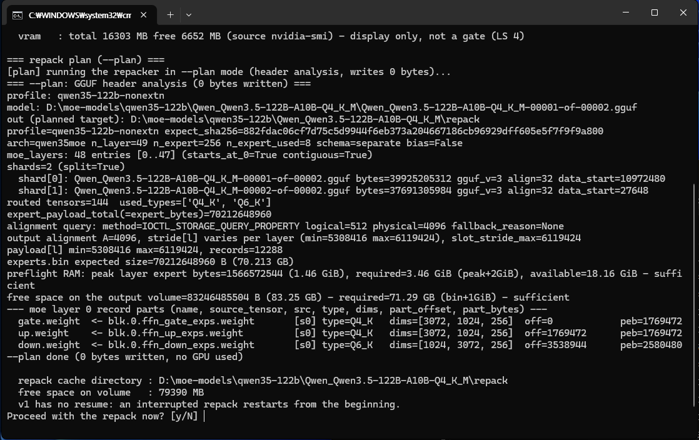
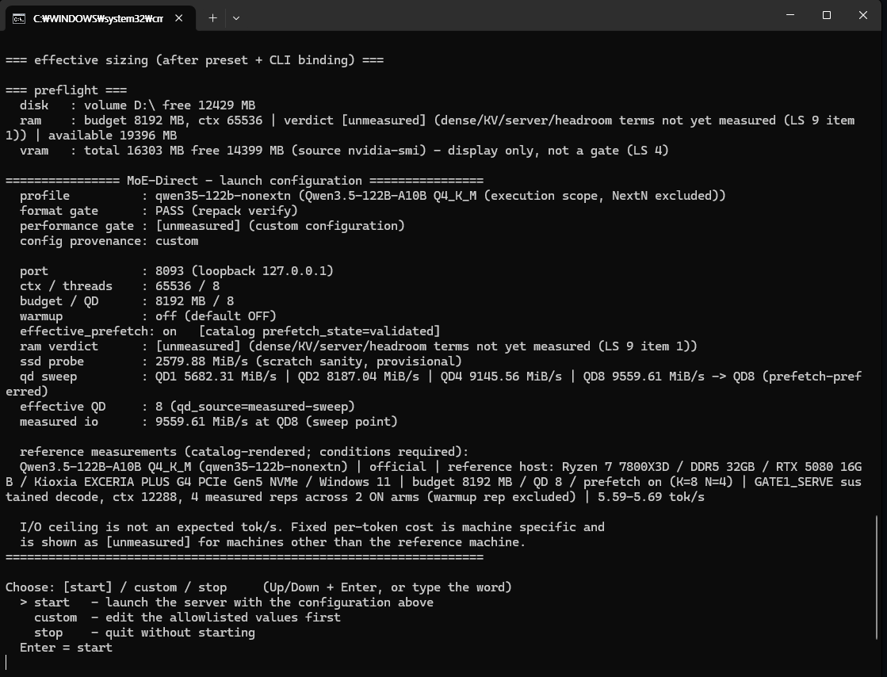
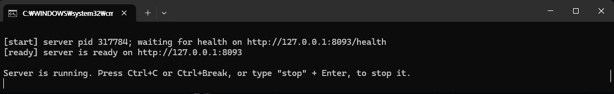

# Getting started

[Back to the README](../README.md)

## Who this release is for

> **v0.2.2 is a public preview aimed at hands-on users.** It runs, it is measured, and its rough
> edges are written down rather than hidden. It is not a one-click app for casual use yet - that
> is a direction, not a promise.

You are comfortable downloading a GGUF from Hugging Face, you have an NVMe SSD and the patience
for a one-time repack, and you want to run MoE models your RAM says you cannot. If that is you,
this release is built for you and you should be able to follow it end to end.

If you are looking for an app that finds, downloads and chats with a model for you, this is not
that, and pretending otherwise would waste your evening. MoE-Direct never downloads model weights:
you bring your own GGUF.

## Before you start

**You need, before anything else:**

| | Requirement | Notes |
|---|---|---|
| OS | Windows 10 or 11, x64 | Windows only in v0.2.2. No Linux/macOS build exists; see [FAQ](faq.md#faq). |
| Runtime | Microsoft Visual C++ Redistributable (x64) | The engine binaries are built with MSVC. Most machines already have it; if it is missing the server cannot start (see [`fail_server_start`](troubleshooting.md#fail_server_start)). Install it from Microsoft's [Latest supported Visual C++ Redistributable downloads](https://learn.microsoft.com/en-us/cpp/windows/latest-supported-vc-redist) page. |
| Storage | An NVMe SSD | This design is I/O bound by construction. Other storage - a SATA SSD, an external drive - is **not validated and not recommended**: the launcher does not block it, it measures your drive and reports the throughput it found. |
| Model | It must be GGUF, and models that have not been tested as of v0.2.3 are also acceptable |  Not all models are supported; for detailed information, Exact repos and revisions in [Supported models](models.md#supported-models). |
| Disk | About **2x the model size**, plus reserve | The repack writes its output next to your GGUF and the original stays. Nothing is deleted. |
| Time | **Minutes to roughly 18 minutes on the recorded machine, once per model** | Recorded there: 61 GB store in 130 s, 72.8 GB in 220 s, 436 GB in 18 min. Another drive may take longer. |
| RAM | Enough for the cache budget the launcher picks | The launcher sizes the expert cache from your installed RAM and the model's slot geometry, between 4 GB and 12 GB, and you can override it. Each profile also has a minimum below which it cannot be served at all: 8 GB for the 122B, 397B, gpt-oss and DeepSeek profiles, 4 GB for the 35B, 10 GB for K2.6. On a first run the sizing needs the slot geometry that the repack produces, so it happens after the repack and its verification; the preflight that runs before any repack output is written checks the explicit or profile-minimum budget instead. |
| Python | Not needed | A pinned CPython runtime for the repacker is included in the zip. |

**Windows will warn you.** v0.x is an *unsigned* public preview, so SmartScreen showing
"Windows protected your PC" is the expected outcome for a new unsigned file, not a sign that
something is wrong with your download - verify the SHA-256 and decide for yourself. On managed
PCs, or with Smart App Control enabled, the file may be blocked outright with no "Run anyway"
option; Smart App Control has no per-app exception. We will never ask you to turn off Defender,
SmartScreen or Smart App Control, to add antivirus exclusions, to change your machine-wide
execution policy, or to run anything as administrator. The code signing is planned, and so far it has not yet been signed. 
We intend to register it naturally as development and progress continue 
Please wait just a little, haha

## Quick start

> Prefer watching first? There is a **full unedited setup walkthrough** (single take, real time,
> with chapters): [youtu.be/I0MRTEn0G6g](https://youtu.be/I0MRTEn0G6g) - it covers everything in
> this section, including the waits you should expect.

**Step 0 - get the right file.** On the Releases page there are exactly two assets:

| Asset | What it is |
|---|---|
| `moe-direct-v0.2.3-win-x64.zip` | The runtime bundle. This is the one you want. |
| `SHA256SUMS.txt` | The checksum of that zip. |

> GitHub also shows an automatically generated **"Source code (zip / tar.gz)"** on every release.
> That is *not* a runnable bundle - it contains no binaries. Do not download it to run
> MoE-Direct.

**Then, in this order.** The order matters: Windows marks downloaded files, and unblocking the zip
*after* extracting does not clean up the files that were already extracted.

1. **Verify the download.** With the zip and `SHA256SUMS.txt` in the same folder, paste this
   one line into PowerShell - it does the hashing and the comparison for you and prints `OK` or
   `MISMATCH`, nothing to compare by eye:
   ```powershell
   if((Get-Content .\SHA256SUMS.txt -Raw) -match (Get-FileHash .\moe-direct-v0.2.3-win-x64.zip -Algorithm SHA256).Hash){'OK: hash matches'}else{'MISMATCH: download again'}
   ```
   On `MISMATCH`, stop and download again. If you skip this step, the launcher still re-verifies
   every file inside the bundle against its sealed manifest on every start, fail-closed; what the
   launcher cannot check for you is that the zip you downloaded is the released one - that is
   what this paste establishes.
2. **Unblock the zip itself** - right-click `moe-direct-v0.2.3-win-x64.zip` -> Properties -> tick
   **Unblock** -> OK. (Equivalent: `Unblock-File .\moe-direct-v0.2.3-win-x64.zip`.)
3. **Extract with Windows "Extract All"** into a **new, empty** folder, for example
   `C:\moe-direct\v0.2.3\`. Other archivers differ in how they propagate the mark-of-the-web, so
   this is the one path we document.
4. **Put your GGUF somewhere the launcher can find it.** Any path works, but if you place models
   under `<drive>:\moe-models\` (up to three levels deep, e.g.
   `D:\moe-models\qwen3.5-122b\<repo-name>\model-00001-of-00002.gguf`) the launcher lists them for
   you and you can pick one with the arrow keys. Multi-shard models must have all their shards in
   one folder.
5. **Double-click `Start-MoeDirect.cmd`** in the extracted folder.
   *Prefer PowerShell?* `Start-MoeDirect.ps1` works too - the `.cmd` delegates to that PowerShell
   launcher, it is only a double-click entry point that starts PowerShell with a bypass scoped to
   that one process (nothing machine-wide is changed, nothing is installed). If you run the `.ps1` by
   right-click -> "Run with PowerShell", the window can close on failure before you read the error;
   run it from an open console instead. The `.cmd` keeps the window open and prints the log folder.

   
   *The extracted folder - `Start-MoeDirect.cmd` is the double-click entry point.*

   
   *The first screen after the bundle integrity check: GGUF files found under
   `<drive>:\moe-models` are listed for arrow-key selection. The menu lists whatever it finds -
   whether a file is actually supported is decided later, by the catalog and the integrity gates.*

   Since v0.2.3 each entry also carries a short label read from that file's own header, so you can
   see before you pick which route the file is likely to take: `[catalog]` for a model the catalog
   describes, `[template: <arch>]` for an unlisted GGUF of an architecture there is a template for,
   `[unsupported]` for one there is not, and `[identify pending]` when the header did not give up
   all four identification fields. The screen says it too: **the labels are provisional.** They come
   from one header read per file, and the real decision at start also weighs the shard count, the
   file sizes and the source pin, so a `[catalog]` label is a good guess and not a verdict.

6. **Approve the one-time repack.** The launcher identifies your model, checks RAM and disk, then
   stops and shows you the exact cost - output size, free space left afterwards, expected time -
   and no model or repack output is created until you answer. This is the long step: minutes to
   roughly 18 minutes on the recorded machine, depending on model size, with
   live progress. There is no resume in v0.2.2; if you cancel, the next run starts the repack from
   the beginning (it will tell you and ask before deleting the partial output).

   
   *The repack plan: exact sizes, RAM and disk preflight, and the y/N prompt - nothing is
   written until you approve.*

7. **Press Enter at the status screen** to start the server, wait for `ready`, and connect a
   client (see [Connecting a client](clients.md#connecting-a-client)).

   
   *The status screen - gate states, the measured queue-depth sweep, and the reference numbers
   with the conditions they require.*

   
   *`ready` - the server is up on its loopback URL and stays in the foreground until you stop it.*

Runs after the first skip the repack entirely: the launcher re-checks the existing output against
its integrity gate, re-measures the drive if it has to, and goes straight to the status screen.

## What success looks like

The status screen tells you, in this order, what will happen when you press Enter: the model and
profile it identified, the disk and RAM it will use, and what pressing Enter does. Queue depth,
gate state and prefetch state are shown below that, as technical detail.

**Your first conversation is usually the slowest one - by design, not by accident.** On a fresh
start the expert cache is empty and fills from the NVMe as you chat, and the first turn has to
prefill your entire prompt from that cold state: seconds for a short question, several minutes
for agent-style clients that send 15k+ token system prompts. The design already softens what it
can - the server is ready in seconds because experts are never bulk-loaded up front, and the
model is usable from the very first token. In a long-lived session that keeps a stable prompt
prefix - which is how agent-style clients behave - later turns reuse the prefix cache instead of
re-reading what was already read, and that reuse is where the multi-turn numbers in
[Measured results](measured-results.md#measured-results) come from; a turn that changes the prefix pays for the
changed part again. So judge the speed by the later turns of a session, not its first one.

Stopping the server still empties the expert cache, which fills from the NVMe again on the next
start. The prefix cache is the part that now survives: the launcher saves the slot state when you stop
cleanly, and restores it next time, so the first turn of the next session does not re-prefill a
prompt that was already processed. [Warm start](warm-start.md#warm-start) describes what that covers and what it
does not.

When the server is up, the launcher prints `ready` with the base URL. When you stop it - `stop` in
the menu, or Ctrl+C - it shuts the server down, confirms the child process and the listening port
are gone, and exits with:

```
[moe-launcher] status=ok
```

That last line is the machine-readable one, on stderr, exactly once, on every run - success or
failure. Every status value is listed in [Troubleshooting](troubleshooting.md#troubleshooting).

Next: [Connecting a client](clients.md)
